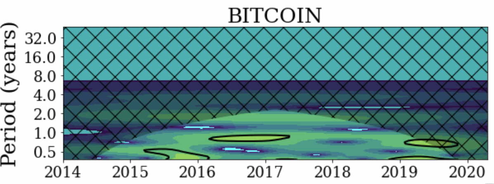
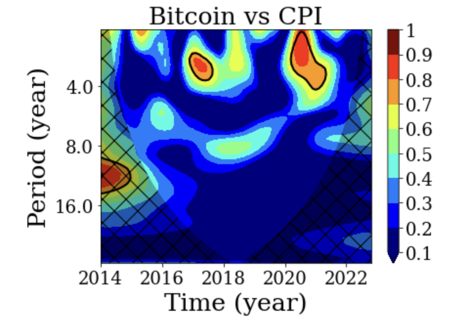

# Financial-Time-Series-Analysis-using-Wavelets
This repo contains Wavelet Analysis of bitcoin and its effect on various economic indicators such as Consumer Price Index(CPI),GDP and Money Supply.

Wavelet Analysis is a powerful tool for compressing, processing, and analyzing data.
With the development of data analysis tools, some traditional ones such as time-series analysis, which focuses on time-
domain and spectral analysis, which focuses on frequency-domain, are reevaluated due to their limitations. The first limitation is
that these traditional techniques usually require a very strong assumption that the data is based on some underlying process; in
particular the data must be stationary (i.e. its mean and variance do not change over time and do not follow any trends). However,
this is hardly true for many economic and financial time series. Usually, variance or volatility of these series follows a complicated
trends and patterns such as structural breaks, clustering and long memory. Another limitation of spectral analysis is that the
frequency decomposition only makes sense when the market activity is stable across the whole period.
# Unlike traditional methods, Wavelet Analysis, which has only been adapted to Economics and Finance recently, possesses several advantages  that help to overcome the limitations discussed above and provide useful information that traditional methods

# The Continuous Wavelet Transform (CWT)

# wavelet coherence (WC)

